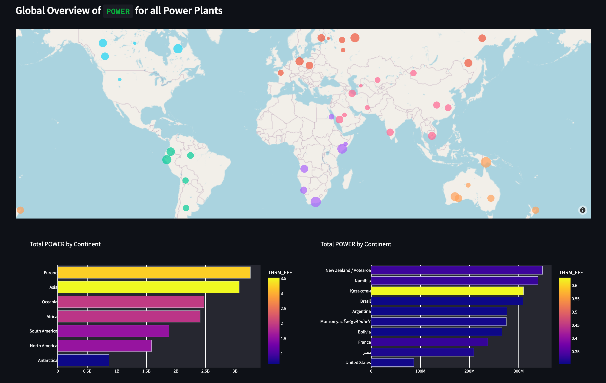

# All my Hacks

Documenting my hackathon projects (and wins)

- [All my Hacks](#all-my-hacks)
  - [ISU Fall 2021 Hackathon](#isu-fall-2021-hackathon)
  - [MongoDB Atlas Hackathon](#mongodb-atlas-hackathon)
  - [HackSC 2022](#hacksc-2022)
  - [Hacklahoma 2022](#hacklahoma-2022)
  - [Hacklytics 2022 by Data Science @ GTech](#hacklytics-2022-by-data-science--gtech)
  - [HackIllinois 2022](#hackillinois-2022)
  - [HackTech 2022](#hacktech-2022)
  - [HooHacks 2022](#hoohacks-2022)
  - [HackPrinceton 2022](#hackprinceton-2022)
  - [DragonHacks 2022](#dragonhacks-2022)
  - [TAMU Datathon 2022](#tamu-datathon-2022)
  - [HackWashU 2022](#hackwashu-2022)

## [ISU Fall 2021 Hackathon](https://tinyurl.com/ycfu6f8o)

Ekans - A reverse snake game where you're the food and you avoid the snake

Prize: Most creative project - $20 gift card

[GitHub](https://github.com/benthecoder/ReverseSnakeGame)

## [MongoDB Atlas Hackathon](https://dev.to/devteam/announcing-the-mongodb-atlas-hackathon-on-dev-4b6m)

A streamlit app that allows users to search through the comments in the "Never Gonna Give You Up" YouTube music video by Rick Astley, or better known as the rickroll video.

Prize: A mug for participation

[GitHub](https://github.com/benthecoder/yt-comments-mongodb-search)

## [HackSC 2022](https://www.hacksc.com/)

[VoteMemes](https://vote-memes.vercel.app/) - A plain React app to vote for the better meme from r/ProgrammerHumor

Prize: ––

[Devpost](https://devpost.com/software/recycleme-58fo3q) | [GitHub](https://github.com/benthecoder/VoteMemes)

## [Hacklahoma 2022](https://2022.hacklahoma.org/)

[VoiceOut](https://voiceout.space/) - A React + Next.js app that allows users to submit reviews on government agencies

Prize: ––

[Devpost](https://devpost.com/software/voice-out) | [GitHub](https://github.com/weichunnn/voice-out)

## [Hacklytics 2022 by Data Science @ GTech](https://hacklytics.io/)

[Ensurance](https://share.streamlit.io/benthecoder/hacklytics2022/main/app.py) - A streamlit app that allows anyone to view insights into their health risks based on their age, gender, and location

Prize: Best Healthcare Hack powered by Anthem - $100 Amazon Gift Card

[Devpost](https://devpost.com/software/tbd-pc9f4d) | [GitHub](https://github.com/benthecoder/Ensurance)

## [HackIllinois 2022](https://www.hackillinois.org/)

[Energytics](https://share.streamlit.io/benthecoder/energytics/main/app.py) - A streamlit app that visualizes and predicts energy generation and consumption for companies and consumers.

Prize: ––

[Devpost](https://devpost.com/software/energytics) | [GitHub](https://github.com/benthecoder/Energytics)

## [HackTech 2022](https://hacktech.app/)

[Savergy](https://share.streamlit.io/benthecoder/savergy/main/app.py) - A streamlit app to help predict energy cost and usage of a building, provide notifications to users to help save energy usage, and to educate the community about how electricity use relates to CO2 emissions.

Prize: Best use of Mage AI (3rd place) - $150 Amazon Gift Card

[Devpost](https://devpost.com/software/savergy) | [GitHub](https://github.com/benthecoder/savergy)

## [HooHacks 2022](https://www.hoohacks.io/)

[Toilet Buddy](https://public-washroom-f51ff.web.app/) - A plain JS + HTML + CSS website that help users find the closest restroom in big cities

Prize: Best Data Science Hack (2nd place) - Echo Dot and Sengled Color Bulb

[Devpost](https://devpost.com/software/toilet-buddy) | [GitHub](https://github.com/cinnyb2/Toliet-Buddy)

## [HackPrinceton 2022](https://www.hackprinceton.com/)

[Readabl](https://readto.beabetterhuman.tech/) - A Svelte + FastAPI app that offers search results along with readability metrics so that users can at a glance see what search results are suitable for them to read.

Prize: 3rd place overall - Tile Bluetooth Tracker Essentials

[Devpost](https://devpost.com/software/searchly-9pn6go) | [GitHub](https://github.com/weichunnn/reader)

## [DragonHacks 2022](https://dragonhacks.live/)

[Foodprint](https://eatyourwayoutofclimatechange.tech/) - A React + Chakra UI + FastAPI app that displays the environmental impacts of foods based on recipes

Prize: 3rd place overall (Seagate Portable 2 TB), Most Creative Domain Name (wireless charger)

[Devpost](https://devpost.com/software/foodprint-fun) | [GitHub](https://github.com/benthecoder/foodprint)

## [TAMU Datathon 2022](https://tamudatathon.com/)

[Gas Turbine Viz](https://benthecoder-gas-turbine-viz-main-page-awsw6p.streamlitapp.com/) - A streamlit app that visualizes the performance of a gas turbine that uses CockroachDB and Twilio

Prize: ––

[Devpost](https://devpost.com/software/tbd-y5nl8h) | [GitHub](https://github.com/benthecoder/gas_turbine_viz)

## [HackWashU 2022](https://hackwashu.com/)

TreeFinance measures the sustainability impact you can make by donating your change to the [Priceless Planet Coalition](https://www.mastercard.us/en-us/vision/corp-responsibility/priceless-planet.html) by tracking your transactions with Plaid. The app uses the Impact Metric Calculator service which lets you know the the number of trees to be planted by the donated amount along with the carbon sequestered over a 5-year period.

Prize: Best use of MasterCard API ($100 Gift Card)

[Devpost](https://devpost.com/software/treefinance) | [GitHub](https://github.com/benthecoder/TreeFinance)
